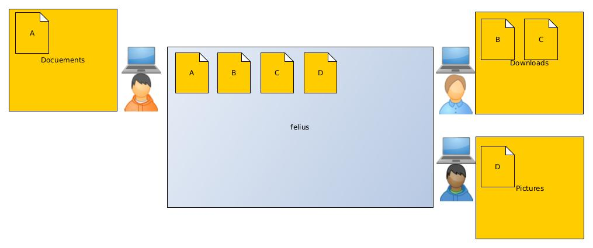

# filius-fileshare
Decentralised filesharing in the local network

> This Project is currently under development is not usable yet

> This Program is currently developed for Linux based systems  
> Windows may be supported later on

# How does it work

Other users have access to the files you marked as shared



# Installation and running

## Installation

```commandline
user@PC:~$ git clone https://github.com/PlayerG9/filius-fileshare.git
user@PC:~$ ./filius-fileshare/scripts/setup
```

## Running

```commandline
user@PC:~$ /path/to/filis-fileshare/filius
```
